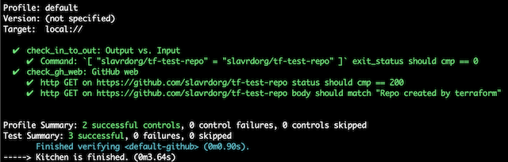

# Terraform GitHub repo

A simple terraform project to manage a GitHub repository under an organization.

## Prerequisites

### To build the Terraform project

* Install Terraform - [instructions](https://www.terraform.io/downloads.html)
* Set up a GitHub access token for a user with appropriate privileges - [instructions](https://help.github.com/articles/creating-a-personal-access-token-for-the-command-line/#creating-a-token)

### To run the Kitchen-CI tests

#### Set up rbenv - instructions for MAC

It is recommended to use rbenv or another Ruby versions manager.

* Install rbenv - run `brew install rbenv`
* Initialize rbenv - add to `~/.bash_profile` line `eval "$(rbenv init -)"`
* Run `source ~/.bash_profile`
* Install ruby 2.3.1 with rbenv - run `rbenv install 2.3.1` , check `rbenv versions`
* Set ruby version for the project to 2.3.1 - run `rbenv local 2.3.1` , check `rbenv local`

#### Install Ruby gems - needed for Kitchen-CI

* Install bundler - run `gem install bundler`
* Refresh rbenv - run `rbenv rehash`
* Install gems from Gemfile - run `bundle install`

## Set up the Terraform project

[Instructions](https://learn.hashicorp.com/terraform/getting-started/variables#assigning-variables) on how to set terraform variables.

Variables to set:

* `gh_token` - your GitHub access token
* `gh_organization` - the GitHub organization under which to crate the repo
* `gh_repo_name` - the name of the repo to be created
* `gh_repo_description` - description for the repo (not required)

## Run Terraform

* Create/Update resources - `terraform apply`
* Destroy resources - `terraform destroy`

## Set up Kitchen-CI

In `.kitchen.yml` set the file containing Terraform variables' values

```YAML
variable_files:
    - /path/to/variables/file
```

## Run Kitchen-CI

* List kitchen environment - `bundle exec kitchen list`
* Build kitchen environment - `bundle exec kitchen converge`
* Run kitchen tests - `bundle exec kitchen verify`
* Destroy kitchen environment - `bundle exec kitchen destroy`
* Automatically build, test, destroy - `bundle exec kitchen test`

A passed Kitchen-CI test should look like:


